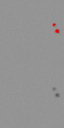
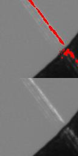

## 说明

### 1. 使用

 在`model/model1/`文件夹中有已经训练好的模型权重文件`model.h5`,可以直接通过keras加载，然后使用。
 
 运行main.py文件即可得到结果，结果将会保存在`temp_data/mask/`文件夹中,

### 2.训练

 将训练的图片放在`raw_data/round_train/part1/OK_Images/`文件中，然后运行`train.py`文件即可，训练好后模型会自动保存到`model/model1/`中
 
### 3.查看结果

 结果均保存在`temp_data/mask/`文件夹中,在`/temp_data/result/data/focusight1_round2_train_part1/TC_Images/`中会有具体缺陷位置坐标的JSON文件
 
 
 

